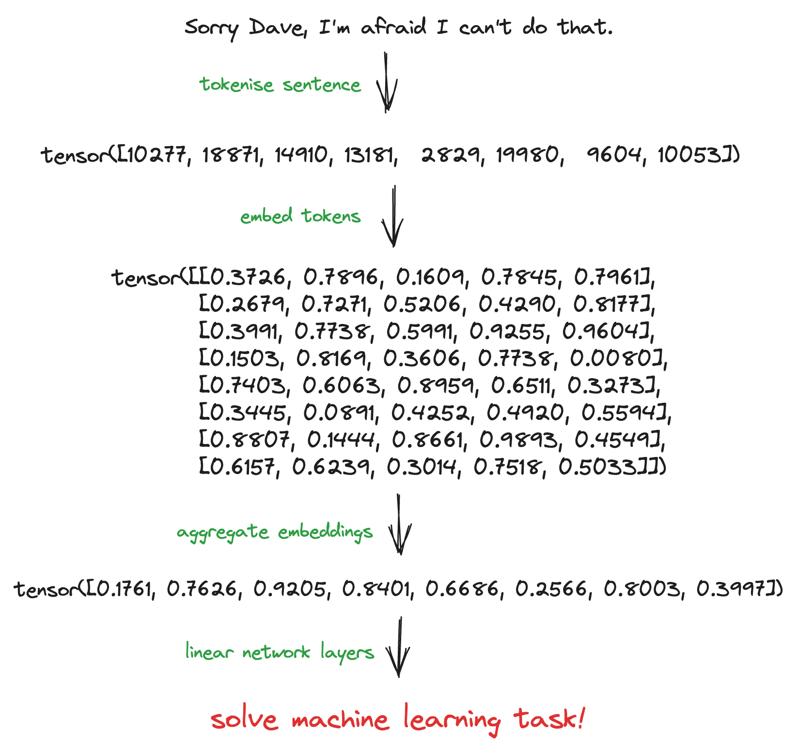
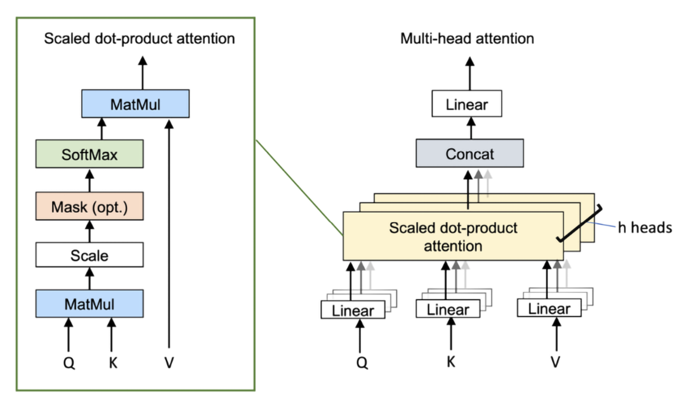

"*Don't let the little fuckers generation gap you.*"

\- William Gibson, Neuromancer

## What I'm intending to talk about

::: incremental

1. The problem we're trying to solve.
2. How to compute multi-head attention.
3. Transformers: encoders, decoders, and all that.
4. How I developed a generative LLM.
5. Exciting things to try with this LLM.
6. Conclusions (heavily opinionated).

:::

## Before we get started

This presentation is based on the codebase at [github.com/AlexIoannides/transformer-gen-ai](https://github.com/AlexIoannides/transformers-gen-ai).

I'm not going to assume you've worked through it, but if you have and there are questions you want to ask, then please do 🙂

## The problem we're trying to solve

---



___

The role that attention plays in all this...


## How to compute multi-head attention

### Let's start with self-attention

---

```python
import math

import torch
import torch.nn as nn
import torch.nn.functional as F

VOCAB_SIZE = 20000
EMBEDDING_DIM = 32


# Let's assume some tokenizer has tokenised our sentence.
tokenized_sentence = torch.randint(0, vocab_size, 8)
n_tokens = len(tokenized_sentence)

# We then map from token to embeddings.
embedding_layer = nn.Embedding(VOCAB_SIZE, EMBEDDING_DIM)
embedded_tokens = embedding_layer(tokenized_sentence)

# And compute self-attention weights.
attn_weights = torch.empty(n_tokens, n_tokens)
for i in range(n_tokens):
    for j in range(n_tokens):
        attn_weights[i, j] = torch.dot(embedded_tokens[i], embedded_tokens[j])

# Normalise the weights, so that they sun to 1.0.
attn_weights_norm = F.softmax(attn_weights / math.sqrt(EMBEDDING_DIM), dim=1)

# And finally use the weights to compute context-aware embeddings.
context_weighted_embeddings = torch.matmul(attn_weights_norm, embedded_tokens)
```

---

More formally...

$$
\vec{x_{i}} \to \vec{z_{i}} = \sum_{j=1}^{N}{a_{ij} \times \vec{x_{j}}}
$$

i.e., we build new embeddings using semantic similarity to selectively pool information from the original embeddings. Note, there aren't any attention-specific parameters that need to be learnt, only the original embeddings. We'll come back to this later.

### Time and causality

In the current setup, the attention-modulated embedding at time $t_1$ is a function of embeddings for tokens that come after. If we want to develop generative models, then this isn't appropriate. A common solution is to use **causal masking**.

___


```python
causal_mask = torch.triu(torch.full((n_tokens, n_tokens), True), diagonal=1)
causal_attn_weights = attn_weights.masked_fill(causal_mask, -1e10)
causal_attn_weights_norm = F.softmax(causal_attn_weights / math.sqrt(EMBEDDING_DIM), dim=1)
```

---

### Learning how to attend

```python
# Define three linear transformations.
u_q = torch.rand(n_tokens, n_tokens)
u_k = torch.rand(n_tokens, n_tokens)
u_v = torch.rand(n_tokens, n_tokens)

# Use these to transform the embedded tokens.
q = torch.matmul(u_q, embedded_tokens)
k = torch.matmul(u_k, embedded_tokens)
v = torch.matmul(u_v, embedded_tokens)

# And then re-work the computation of the attention weights.
attn_weights_param = torch.empty(n_tokens, n_tokens)

for i in range(n_tokens):
    for j in range(n_tokens):
        attn_weights_param[i, j] = torch.dot(q[i], k[j])

attn_weights_param_norm = F.softmax(
    attn_weights_param / math.sqrt(EMBEDDING_DIM), dim=1
)
context_weighted_embeddings_param = torch.matmul(attn_weights_param_norm, v)
```

This is equivalent to passing `embedded_tokens` through three separate linear network layers and using the outputs within the self-attention mechanism.

### From single to multiple attention heads



___

We have now arrived at

`torch.nn.MultiheadAttention`

## Transformers: encoders, decoders, and all that

___

How do we arrive at

`torch.nn.TransformerEncoderLayer`
`torch.nn.TransformerDecoderLayer`

?

---

Encoder-decoder for seq-to-seq translation

{width=40%}

\- "*Attention is all you Need*", Vaswani et al. (2023)

---

“*The 'Attention is all you need' paper was written at a time when the idea of factoring feature spaces into independent subspaces had been shown to provide great benefits for computer vision models—both in the case of depth-wise separable convolutions, and in the case of a closely related approach, grouped convolutions. Multi-head attention is simply the application of the same idea to self-attention...*"

___

"*That’s roughly the thought process that I imagine unfolded in the minds of the inventors of the Transformer architecture at the time. Factoring outputs into multiple independent spaces, adding residual connections, adding normalization layers—all of these are standard architecture patterns that one would be wise to leverage in any complex model. Together, these bells and whistles form the Transformer encoder—one of two critical parts that make up the Transformer architecture*”

\- François Chollet (the author of Keras)

___

### When do we use encoders, decoders, or both?

::: incremental

- **Encoder**: pure embedding models.
- **Decoder**: generative models.
- **Encoder + Decoder**: sequence-to-sequence models.

:::

## How I developed a generative LLM

<!--
- the dataset
- preparing the data - tokenisation
- preparing the data - PyTorch DataLoaders
- an aside on GPUs
- benchmark - training an RNN.
- using a generative model to generate text, given a prompt. 
- training a transformer-decoder.
    - positional encoding
    - learning rate schedule
-->

### The data

TODO

### Generating tokens

TODO

### Datasets and DataLoaders

TODO

### Benchmarking with an RNN

TODO

### Generative transformer-decoder

TODO

## Exciting things to try with this LLM

<!--
- semantic search
- sentiment classification
-->

## Conclusions (heavily opinionated)

<!--
- We have achieved full AutoNLP.
- This is alchemy, not physics.
- Emergent capabilities is probably a fallacy.
- But it has been shown that deep learning can grok...
- ... but for now probably just VERY useful stochastic parrots.
-->


## Appendix

```python
class FilmReviewSequences(IterableDataset):
    """IMDB film reviews for training generative models."""

    def __init__(
        self,
        tokenized_reviews: Iterable[list[int]],
        max_seq_len: int = 40,
        min_seq_len: int = 20,
        chunk_eos_token: int | None = None,
        chunk_overlap: bool = True,
        tag: str = "data",
    ):
        self._data_file_path = TORCH_DATA_STORAGE_PATH / f"imdb_sequences_{tag}.json"

        with open(self._data_file_path, mode="w") as file:
            if chunk_eos_token:
                for tok_review in tokenized_reviews:
                    tok_chunks_itr = make_chunks(
                        tok_review,
                        chunk_eos_token,
                        max_seq_len,
                        min_seq_len,
                        chunk_overlap
                    )
                    for tok_chunk in tok_chunks_itr:
                        file.write(json.dumps(tok_chunk) + "\n")
            else:
                for tok_review in tokenized_reviews:
                    file.write(json.dumps(tok_review[:max_seq_len]) + "\n")

```

---

```python
class FilmReviewSequences(IterableDataset):
    """IMDB film reviews for training generative models."""

    ...

    def __len__(self) -> int:
        with open(self._data_file_path) as file:
            num_chunks = sum(1 for line in file)
        return num_chunks

    def __iter__(self) -> Iterable[tuple[Tensor, Tensor]]:
        with open(self._data_file_path) as file:
            for line in file:
                tokenized_chunk = json.loads(line)
                yield (tensor(tokenized_chunk[:-1]), tensor(tokenized_chunk[1:]))
```

### Section Three Point Two
